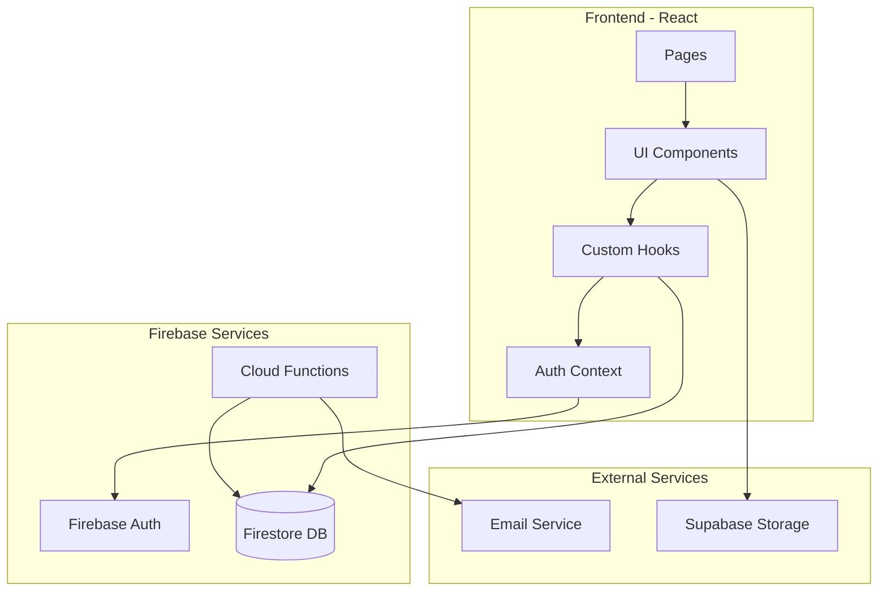
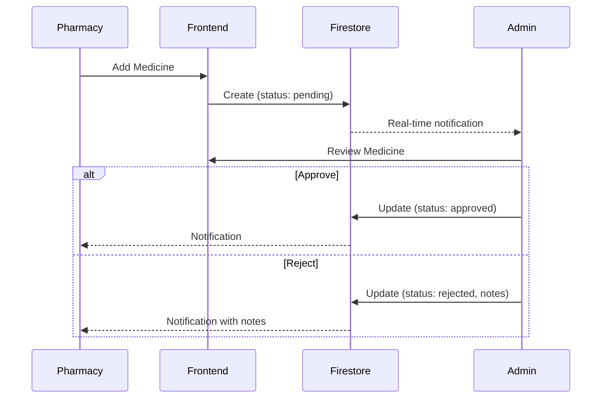

# Design Document: Pharmacy Management System

## Overview

نظام إدارة صيدليات احترافي مبني على React + TypeScript مع Firebase للمصادقة و Firestore لقاعدة البيانات. يوفر النظام واجهة إدارة مركزية للـ Admin مع تحكم كامل في الصيدليات والأدوية، ونظام مراجعة للأدوية قبل نشرها.

### Key Design Decisions

1. **Firebase Auth + Firestore**: استخدام Firebase للمصادقة مع Firestore لتخزين البيانات بما يتوافق مع البنية الحالية
2. **Role-Based Access Control**: نظام صلاحيات مبني على الأدوار (admin/pharmacist)
3. **Medicine Approval Workflow**: سير عمل مراجعة الأدوية مع حالات (pending/approved/rejected)
4. **Audit Trail**: سجل كامل لجميع الإجراءات المهمة
5. **Real-time Updates**: تحديثات فورية باستخدام Firestore listeners

## Architecture



### Data Flow



## Components and Interfaces

### Core Interfaces

```typescript
// Pharmacy Status Types
type PharmacyStatus = 'active' | 'inactive' | 'suspended';

// Medicine Status Types
type MedicineStatus = 'pending' | 'approved' | 'rejected';

// Audit Action Types
type AuditAction = 
  | 'pharmacy_created'
  | 'pharmacy_activated'
  | 'pharmacy_deactivated'
  | 'pharmacy_suspended'
  | 'medicine_approved'
  | 'medicine_rejected'
  | 'limit_updated';

// Extended Pharmacy Interface
interface PharmacyAccount {
  id: string;
  pharmacyId: number;
  name: string;
  email: string;
  address: string;
  city: string;
  phoneNumber: string;
  ownerName: string;
  licenseNumber: string;
  status: PharmacyStatus;
  medicineLimit: number;
  currentMedicineCount: number;
  emailVerified: boolean;
  failedLoginAttempts: number;
  lockedUntil: Date | null;
  createdAt: Date;
  updatedAt: Date;
  createdBy: string; // Admin ID
}

// Extended Medicine Interface
interface MedicineWithApproval {
  id: string;
  name: string;
  code: string;
  description: string;
  price: number;
  quantity: number;
  category: string;
  manufacturer: string;
  expiryDate: Date;
  imageUrl: string;
  pharmacyId: string;
  pharmacyName: string;
  status: MedicineStatus;
  rejectionNotes: string | null;
  reviewedBy: string | null;
  reviewedAt: Date | null;
  createdAt: Date;
  updatedAt: Date;
}

// Audit Log Interface
interface AuditLog {
  id: string;
  action: AuditAction;
  actorId: string;
  actorEmail: string;
  actorRole: 'admin' | 'pharmacist';
  targetId: string;
  targetType: 'pharmacy' | 'medicine';
  details: Record<string, any>;
  timestamp: Date;
}

// Session Interface
interface PharmacySession {
  sessionId: string;
  pharmacyId: string;
  createdAt: Date;
  expiresAt: Date;
  isValid: boolean;
}
```

### Service Interfaces

```typescript
// Pharmacy Management Service
interface IPharmacyService {
  createPharmacy(data: CreatePharmacyInput): Promise<PharmacyAccount>;
  getPharmacies(filters?: PharmacyFilters): Promise<PharmacyAccount[]>;
  getPharmacyById(id: string): Promise<PharmacyAccount | null>;
  updatePharmacyStatus(id: string, status: PharmacyStatus): Promise<void>;
  updateMedicineLimit(id: string, limit: number): Promise<void>;
  searchPharmacies(query: string, filters?: PharmacyFilters): Promise<PharmacyAccount[]>;
}

// Medicine Management Service
interface IMedicineService {
  createMedicine(data: CreateMedicineInput): Promise<MedicineWithApproval>;
  getMedicinesByPharmacy(pharmacyId: string): Promise<MedicineWithApproval[]>;
  getPendingMedicines(): Promise<MedicineWithApproval[]>;
  updateMedicine(id: string, data: UpdateMedicineInput): Promise<void>;
  approveMedicine(id: string, adminId: string): Promise<void>;
  rejectMedicine(id: string, adminId: string, notes: string): Promise<void>;
  canAddMedicine(pharmacyId: string): Promise<boolean>;
}

// Audit Service
interface IAuditService {
  logAction(action: AuditAction, actorId: string, targetId: string, details: Record<string, any>): Promise<void>;
  getAuditLogs(filters?: AuditFilters): Promise<AuditLog[]>;
  exportAuditLogs(filters?: AuditFilters): Promise<string>; // CSV string
}

// Auth Service Extension
interface IPharmacyAuthService {
  loginPharmacy(email: string, password: string): Promise<PharmacySession>;
  logoutPharmacy(sessionId: string): Promise<void>;
  validateSession(sessionId: string): Promise<boolean>;
  handleFailedLogin(email: string): Promise<void>;
  isAccountLocked(email: string): Promise<boolean>;
}
```

### React Hooks

```typescript
// usePharmacyManagement Hook
interface UsePharmacyManagement {
  pharmacies: PharmacyAccount[];
  isLoading: boolean;
  error: Error | null;
  createPharmacy: (data: CreatePharmacyInput) => Promise<void>;
  updateStatus: (id: string, status: PharmacyStatus) => Promise<void>;
  updateLimit: (id: string, limit: number) => Promise<void>;
  searchPharmacies: (query: string) => void;
  filterByStatus: (status: PharmacyStatus | 'all') => void;
}

// useMedicineApproval Hook
interface UseMedicineApproval {
  pendingMedicines: MedicineWithApproval[];
  isLoading: boolean;
  error: Error | null;
  approveMedicine: (id: string) => Promise<void>;
  rejectMedicine: (id: string, notes: string) => Promise<void>;
  filterMedicines: (filters: MedicineFilters) => void;
}

// usePharmacyMedicines Hook
interface UsePharmacyMedicines {
  medicines: MedicineWithApproval[];
  groupedMedicines: {
    pending: MedicineWithApproval[];
    approved: MedicineWithApproval[];
    rejected: MedicineWithApproval[];
  };
  canAddMore: boolean;
  currentCount: number;
  limit: number;
  isLoading: boolean;
  addMedicine: (data: CreateMedicineInput) => Promise<void>;
  updateMedicine: (id: string, data: UpdateMedicineInput) => Promise<void>;
}

// useAuditLogs Hook
interface UseAuditLogs {
  logs: AuditLog[];
  isLoading: boolean;
  filterLogs: (filters: AuditFilters) => void;
  exportToCSV: () => Promise<void>;
}
```

## Data Models

### Firestore Collections Structure

```
/pharmacies/{pharmacyId}
  - id: string
  - pharmacyId: number
  - name: string
  - email: string
  - address: string
  - city: string
  - phoneNumber: string
  - ownerName: string
  - licenseNumber: string
  - status: 'active' | 'inactive' | 'suspended'
  - medicineLimit: number
  - currentMedicineCount: number
  - emailVerified: boolean
  - failedLoginAttempts: number
  - lockedUntil: timestamp | null
  - createdAt: timestamp
  - updatedAt: timestamp
  - createdBy: string

/medicines/{medicineId}
  - id: string
  - name: string
  - code: string
  - description: string
  - price: number
  - quantity: number
  - category: string
  - manufacturer: string
  - expiryDate: timestamp
  - imageUrl: string
  - pharmacyId: string
  - pharmacyName: string
  - status: 'pending' | 'approved' | 'rejected'
  - rejectionNotes: string | null
  - reviewedBy: string | null
  - reviewedAt: timestamp | null
  - createdAt: timestamp
  - updatedAt: timestamp

/auditLogs/{logId}
  - id: string
  - action: string
  - actorId: string
  - actorEmail: string
  - actorRole: string
  - targetId: string
  - targetType: string
  - details: map
  - timestamp: timestamp

/users/{userId}
  - ... existing fields ...
  - role: 'admin' | 'pharmacist' | 'user'
  - pharmacyId: string (for pharmacists)
```

### State Management

```typescript
// Dashboard Statistics State
interface DashboardState {
  totalPharmacies: number;
  activePharmacies: number;
  inactivePharmacies: number;
  suspendedPharmacies: number;
  totalMedicines: number;
  pendingMedicines: number;
  approvedMedicines: number;
  rejectedMedicines: number;
}

// Filter States
interface PharmacyFilters {
  status?: PharmacyStatus | 'all';
  searchQuery?: string;
  sortBy?: 'name' | 'createdAt' | 'medicineCount';
  sortOrder?: 'asc' | 'desc';
}

interface MedicineFilters {
  status?: MedicineStatus | 'all';
  pharmacyId?: string;
  dateRange?: { start: Date; end: Date };
  category?: string;
}

interface AuditFilters {
  action?: AuditAction | 'all';
  actorId?: string;
  dateRange?: { start: Date; end: Date };
  targetType?: 'pharmacy' | 'medicine' | 'all';
}
```

## Correctness Properties

*A property is a characteristic or behavior that should hold true across all valid executions of a system—essentially, a formal statement about what the system should do. Properties serve as the bridge between human-readable specifications and machine-verifiable correctness guarantees.*

### Property 1: Pharmacy Creation Security

*For any* pharmacy creation request with valid data, the created pharmacy SHALL have a hashed password (not plaintext) and status set to 'inactive'.

**Validates: Requirements 1.1**

### Property 2: Pharmacy Search Accuracy

*For any* search query and set of pharmacies, the search results SHALL only contain pharmacies where the name, email, or status matches the query criteria.

**Validates: Requirements 1.4**

### Property 3: Pharmacy Status Transitions

*For any* pharmacy status change operation, the pharmacy status SHALL be updated correctly AND an audit log entry SHALL be created with the correct action type.

**Validates: Requirements 1.5, 1.6, 1.7**

### Property 4: Authentication with Status-Based Access

*For any* login attempt, the system SHALL grant access only if credentials are valid AND pharmacy status is 'active'. Inactive or suspended pharmacies SHALL be denied access.

**Validates: Requirements 2.1, 2.2**

### Property 5: Session Validity

*For any* session, after logout or expiration, the session SHALL be invalid and require re-authentication.

**Validates: Requirements 2.3, 2.4**

### Property 6: Medicine Creation Status

*For any* new medicine created by a pharmacy, the medicine status SHALL be 'pending' regardless of other input data.

**Validates: Requirements 3.1**

### Property 7: Medicine Limit Enforcement

*For any* pharmacy with a medicine limit, the system SHALL prevent adding new medicines when currentMedicineCount >= medicineLimit, while preserving all existing medicines.

**Validates: Requirements 3.2, 5.1, 5.2, 5.3**

### Property 8: Medicine Status Grouping

*For any* pharmacy's medicine list, medicines SHALL be correctly grouped by their status (pending, approved, rejected) with no medicine appearing in multiple groups.

**Validates: Requirements 3.3**

### Property 9: Medicine Edit Permissions

*For any* medicine edit operation:
- Pending medicines SHALL be editable by the owning pharmacy
- Rejected medicines SHALL be editable and reset to pending status
- Approved medicines SHALL NOT be editable without Admin permission

**Validates: Requirements 3.4, 3.5, 3.6**

### Property 10: Medicine Review with Audit

*For any* medicine approval or rejection by Admin, the medicine status SHALL be updated correctly AND an audit log SHALL be created with Admin ID, timestamp, and action details.

**Validates: Requirements 4.2, 4.3, 4.5**

### Property 11: Medicine Filtering

*For any* filter criteria applied to medicines, the results SHALL only contain medicines matching ALL specified criteria (status, pharmacy, date range).

**Validates: Requirements 4.4**

### Property 12: Rejection Notes Lifecycle

*For any* rejected medicine, rejection notes SHALL be visible to the pharmacy. When the medicine is resubmitted, previous rejection notes SHALL be cleared.

**Validates: Requirements 6.1, 6.3**

### Property 13: Audit Log Creation

*For any* significant action (pharmacy creation, status change, medicine approval/rejection), an audit log entry SHALL be created with action type, actor ID, target ID, timestamp, and relevant details.

**Validates: Requirements 7.1**

### Property 14: Audit Log Immutability

*For any* existing audit log entry, modification or deletion operations SHALL fail, preserving the original log data.

**Validates: Requirements 7.4**

### Property 15: Dashboard Statistics Accuracy

*For any* dashboard view, the displayed statistics SHALL accurately reflect the current counts in the database (total pharmacies, active/inactive counts, pending medicines count).

**Validates: Requirements 8.1**

### Property 16: CSV Export Round-Trip

*For any* data export operation, exporting data to CSV and then parsing the CSV SHALL produce data equivalent to the original dataset.

**Validates: Requirements 10.1, 10.2, 10.3**

## Error Handling

### Authentication Errors

```typescript
class AuthenticationError extends Error {
  constructor(
    message: string,
    public code: 'INVALID_CREDENTIALS' | 'ACCOUNT_LOCKED' | 'ACCOUNT_INACTIVE' | 'ACCOUNT_SUSPENDED' | 'SESSION_EXPIRED'
  ) {
    super(message);
    this.name = 'AuthenticationError';
  }
}
```

### Authorization Errors

```typescript
class AuthorizationError extends Error {
  constructor(
    message: string,
    public code: 'INSUFFICIENT_PERMISSIONS' | 'MEDICINE_LIMIT_REACHED' | 'EDIT_NOT_ALLOWED'
  ) {
    super(message);
    this.name = 'AuthorizationError';
  }
}
```

### Validation Errors

```typescript
class ValidationError extends Error {
  constructor(
    message: string,
    public field: string,
    public code: 'REQUIRED' | 'INVALID_FORMAT' | 'DUPLICATE' | 'OUT_OF_RANGE'
  ) {
    super(message);
    this.name = 'ValidationError';
  }
}
```

### Error Handling Strategy

1. **UI Layer**: Display user-friendly error messages in Arabic
2. **Service Layer**: Log errors with full context for debugging
3. **Audit Layer**: Log security-related errors (failed logins, unauthorized access attempts)

## Testing Strategy

### Unit Tests

Unit tests will focus on:
- Individual service functions (pharmacy CRUD, medicine CRUD)
- Validation logic (email format, required fields)
- Status transition logic
- Filter and search functions
- CSV export formatting

### Property-Based Tests

Property-based tests will use **fast-check** library for TypeScript to verify:
- All 16 correctness properties defined above
- Each property test will run minimum 100 iterations
- Tests will be tagged with property number and requirements reference

**Test Configuration**:
```typescript
import fc from 'fast-check';

// Minimum 100 iterations per property
const propertyConfig = { numRuns: 100 };
```

**Test Annotation Format**:
```typescript
// Feature: pharmacy-management-system, Property 1: Pharmacy Creation Security
// Validates: Requirements 1.1
test('pharmacy creation should have hashed password and inactive status', () => {
  fc.assert(
    fc.property(/* generators */, (input) => {
      // property assertion
    }),
    propertyConfig
  );
});
```

### Integration Tests

Integration tests will verify:
- End-to-end pharmacy creation and activation flow
- Medicine submission and approval workflow
- Audit log creation across operations
- Real-time updates via Firestore listeners

### Test Data Generators

```typescript
// Pharmacy data generator
const pharmacyGenerator = fc.record({
  name: fc.string({ minLength: 2, maxLength: 100 }),
  email: fc.emailAddress(),
  password: fc.string({ minLength: 8, maxLength: 50 }),
  address: fc.string({ minLength: 5, maxLength: 200 }),
  city: fc.string({ minLength: 2, maxLength: 50 }),
  phoneNumber: fc.stringOf(fc.constantFrom('0', '1', '2', '3', '4', '5', '6', '7', '8', '9'), { minLength: 10, maxLength: 15 }),
  ownerName: fc.string({ minLength: 2, maxLength: 100 }),
  licenseNumber: fc.string({ minLength: 5, maxLength: 20 })
});

// Medicine data generator
const medicineGenerator = fc.record({
  name: fc.string({ minLength: 2, maxLength: 100 }),
  code: fc.string({ minLength: 3, maxLength: 20 }),
  description: fc.string({ minLength: 10, maxLength: 500 }),
  price: fc.float({ min: 0.01, max: 10000, noNaN: true }),
  quantity: fc.integer({ min: 0, max: 10000 }),
  category: fc.constantFrom('pain_relief', 'antibiotics', 'vitamins', 'skincare', 'other'),
  manufacturer: fc.string({ minLength: 2, maxLength: 100 })
});
```
